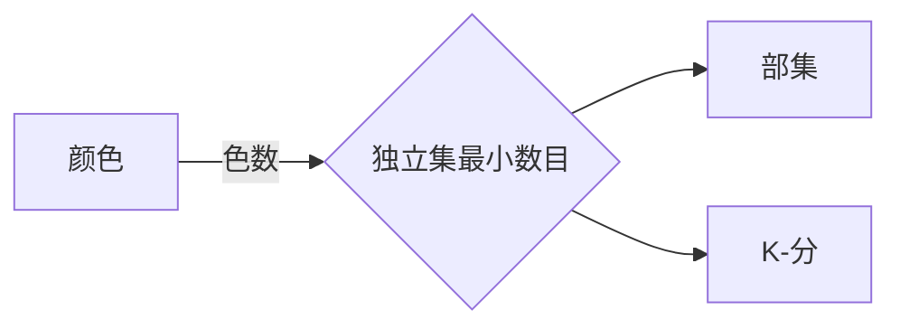
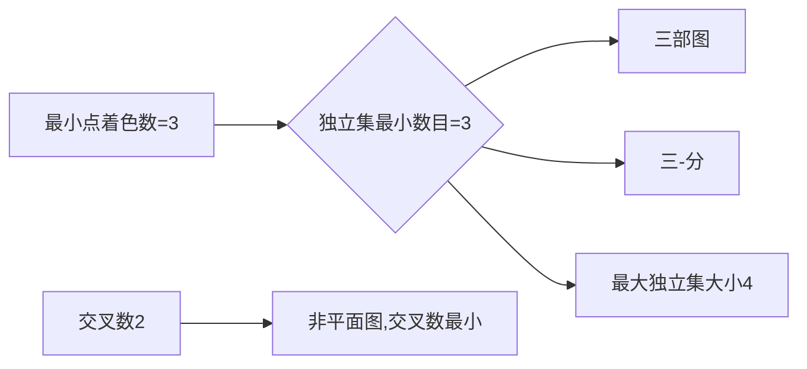

# Graph Theory

---

### 1.Basic Concepts

圈两个端点相同，简单图不含圈和重边，

顶点集和边集是空集的称为空图

#### 相识关系与子图

6个人有三个人相互认识或相互陌生

​																							$$G$$

​																							$$\overline G$$

团：两两相邻的顶点，$$G$$中$$\{u,x,y\}$$

独立集（稳定集），两两不相邻。$$G$$中$$\{u,w\}$$

#### 二部图与任务分派

<u>两个不相交独立集（可空）</u>的并集

​				部集

#### 日程表与图的着色

<u>使每条边端点有不同标记</u>，只对顶点集划分感兴趣，标记没有数值意义，称为**颜色**

颜色最小数目：图的色数，$$\chi(G)$$. 

#### 地图与着色

**可平面图**：在一个平面中画出，且没有相互交叉的边：**地图**

#### **公路网中的路线问题**

**边加权**

路径，环

每一对顶点都属于某一条路径，则连通

顶点序列：$$x,b,a,z,y$$

<u>子图：$$V(H)\subseteq V(G),E(H)\subseteq E(G)$$,边端点分配和$$G$$中的一样</u>

$$H\subseteq G$$,$$G$$的某种子图同构于$$H$$

##### <u>邻接矩阵</u>&<u>关联矩阵</u>😊

$$n\times n$$点与点 ，$$n\times m$$点与边

$$
邻接矩阵
\left(
\begin{smallmatrix}
0 &1 &1 &0\\
1 &0 &2 &0\\
1 &2 &0 &1\\
0 &0 &1 &0\\
\end{smallmatrix}
\right)
关联矩阵
\left(
\begin{smallmatrix}
1 &1 &0 &0 &0\\
1 &0 &1 &1 &0\\
0 &1 &1 &1 &1\\
0 &0 &0 &0 &1\\
\end{smallmatrix}
\right)
$$

##### 同构：$$f:V(G)\to V(H)$$

$$uv\in E(G),f(u)f(v)\in E(H) 则G\cong H$$  

非简单图同构：严格的映射

​																													$$K_5$$

​																													$$K_{2,3}$$

​																								含$$n$$个顶点(无标记)的路径和环记为$$P_n和C_n$$

对图命名，指它同构类(拷贝）。

自补图，图的分解：G的每条边只出现在一个子图内。

一个$$n-顶点图H$$是自补当且仅当$$K_n$$的某个分解包含了$$H$$的两个拷贝；

$$5-环$$是自补的；3个$$P_3$$的拷贝是$$K_4$$的一种分解

$$K_7$$分解成7个$$K_3$$的拷贝

$$k_6$$分解成5个$$P_4$$的拷贝

##### Peterson图

围长是最短环的长度，无环图是$$\infty$$

​																5-元素集合的所有2-元素集合，其边是互不相交2-元素子集对，每个顶点的度数为3

1.两个顶点不邻接，则它们有一个公共相邻顶点。
$$
\{4,5\}\cup\{3,4\}=\{3,4,5\}\\
\{1,2,3,4,5\}\setminus\{3,4,5\}=\{1,2\}
$$
2.Peterson图的围长是5

1，2不考虑；3个互不相交->6;4由1知不可

$G$的自同构是从$$G到G$$的同构

若$$u,v\in V(G)$$,都存在$$G$$的一个自同构，称其是顶点传递的。

​																										$$是V(G)的排列，A(G)$$不变

​																											$$K_{r,s}$$有$$r!s!$$个自同构，$$r=s$$,才是顶点传递

​																											$$n>2$$,$$P_n$$不是顶点传递的

​														

